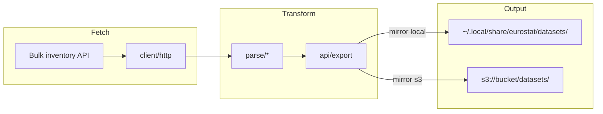

# Architecture

Overview of the `eurostat` workspace: module layout, feature flags, and the bulk mirror data flow.

## Workspace

| Crate | Role |
|-------|------|
| `crates/eurostat` | Async library — HTTP clients, parsers, export, mirror/S3 |
| `crates/eurostat-cli` | CLI binary (`eurostat`) wrapping the library |

## Library module map

```
crates/eurostat/src/
├── lib.rs           # public re-exports
├── config.rs        # paths, env defaults
├── error.rs         # Error / Result
├── model.rs         # shared types (BulkFile, OutputFormat, …)
├── client/          # EurostatClient facade + HTTP
├── parse/           # TSV, SDMX-CSV, COMEXT CSV, JSON-stat, TOC XML
├── api/             # API sub-clients and export/cache/bulk
│   ├── catalogue.rs
│   ├── statistics.rs
│   ├── comext.rs
│   ├── sdmx.rs
│   ├── async_jobs.rs
│   ├── bulk.rs      # feature: bulk
│   ├── export.rs    # feature: export
│   ├── cache.rs     # feature: cache
│   └── search.rs    # feature: cache
└── mirror/          # feature: mirror (bulk + export)
    ├── mod.rs       # MirrorSource, options, file selection
    ├── convert.rs   # bulk → parquet.zstd bytes
    ├── manifest.rs  # manifest.jsonl progress
    ├── local.rs     # disk mirror pipeline
    └── s3.rs        # feature: s3 — stream upload
```

Public API surface stays flat via `lib.rs` re-exports (`eurostat::catalogue`, `eurostat::export`, etc.) even though implementation lives under `api/`.

## Feature flags

| Feature | Enables | Notes |
|---------|---------|-------|
| `cache` | SQLite catalogue + FTS search | Heavy: `sqlx` |
| `export` | Arrow/Parquet/ZSTD export | Heavy: `arrow`, `parquet` |
| `bulk` | Bulk inventory client | Adds `indicatif` |
| `mirror` | Local mirror pipeline | Implies `bulk` + `export` |
| `s3` | S3-compatible upload mirror | Implies `mirror`; adds `rust-s3` |
| `fuzzy-search` | Fuzzy matching in search | Optional on top of `cache` |

Default features: `cache`, `export`, `bulk`, `mirror`.

Fast dev check without heavy deps:

```bash
cargo check -p eurostat --no-default-features
```

## Data flow: Eurostat API → parse → export → S3



1. **Inventory** — `api/bulk` lists dissemination `tsv.gz` / SDMX-CSV files (and COMEXT `.7z` archives).
2. **Download** — `client/http` fetches raw bytes per file.
3. **Parse** — `parse/tsv`, `parse/sdmx_csv`, or `parse/comext_csv` normalize tabular data.
4. **Export** — `api/export` writes ZSTD-compressed Parquet in memory.
5. **Mirror**
   - **Local** — `mirror/local` writes files under `EUROSTAT_DATA_DIR/datasets/` and appends `manifest.jsonl`.
   - **S3** — `mirror/s3` uploads to `datasets/{prefix}/{dataset_id}.parquet.zstd` and appends progress to `manifest/manifest.jsonl` (batched). Check with `eurostat mirror status --s3`.

Object keys use the first four characters of the dataset id as a prefix (e.g. `nama/nama_10_gdp.parquet.zstd`).

## CLI commands

The CLI (`crates/eurostat-cli/src/commands/`) maps subcommands to library clients: `cache`, `search`, `fetch`, `bulk`, `mirror run`, `mirror s3`, etc.

## Reference

- Configuration (env vars): [CONFIGURATION.md](CONFIGURATION.md)
- Server setup & S3 sync: [SERVER.md](SERVER.md)
- Eurostat API: [official docs](https://ec.europa.eu/eurostat/web/user-guides/data-browser/api-data-access/api-introduction)
- Historical planning notes: [PLAN.md](PLAN.md)
