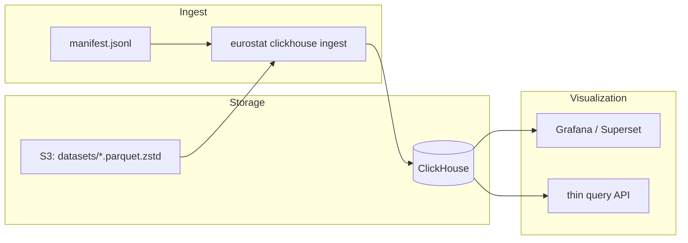

# ClickHouse ingestion plan

Load Eurostat data from Hetzner S3 (`parquet.zstd`) into ClickHouse for analytics and visualization.

**Operations runbook:** [DEPLOY.md](DEPLOY.md) — background jobs, cron, monitoring, validation.  
**Prerequisite:** S3 mirror running via `./scripts/sync-s3.sh` (see [SERVER.md](SERVER.md))

---

## Current state

| Layer | Status |
|-------|--------|
| Eurostat API → Parquet ZSTD | ✅ `eurostat mirror s3` |
| S3 bucket `eurostat` | ✅ `datasets/{prefix}/{id}.parquet.zstd` |
| S3 manifest | ✅ `manifest/manifest.jsonl` (resume / progress) |
| ClickHouse server | ✅ running locally (`127.0.0.1:9000` native, `8123` HTTP) |
| ClickHouse schema v2 | ✅ `sql/clickhouse/002_schema.sql` |
| ClickHouse ingest CLI | ✅ `eurostat clickhouse ingest` |
| Codelists (GEO, UNIT) | ✅ `eurostat clickhouse load-codelists` |

### Parquet shape (per dataset)

Each file is ZSTD-compressed Parquet with **variable columns**:

- Dimension columns — `String` (e.g. `geo`, `time`, `unit`, `freq` — differs per dataset)
- `value` — `Float64`
- `status` — `String` (Eurostat flags, nullable)

~8k datasets, highly heterogeneous schemas. A single fixed wide table will not work without normalization.

---

## Target architecture



**Design choice:** normalize every dataset into a **long / tidy** fact table plus a **catalogue** dimension table. This keeps one query surface for dashboards regardless of per-dataset column layout.

---

## ClickHouse schema (v1)

### Database

```sql
CREATE DATABASE IF NOT EXISTS eurostat;
```

### Catalogue — dataset metadata

Populated from SQLite cache (`eurostat cache refresh`) and/or S3 manifest.

```sql
CREATE TABLE eurostat.catalogue
(
    dataset_id   LowCardinality(String),
    title        String,
    prefix       LowCardinality(String),  -- first path segment, e.g. "nama"
    s3_key       String,
    row_count    Nullable(UInt64),
    last_synced  Nullable(DateTime),
    dimensions   Array(String),            -- known dimension ids when available
    updated_at   DateTime DEFAULT now()
)
ENGINE = ReplacingMergeTree(updated_at)
ORDER BY dataset_id;
```

### Observations — normalized facts

```sql
CREATE TABLE eurostat.observations
(
    dataset_id  LowCardinality(String),
    dimensions  Map(String, String),       -- e.g. {'geo':'DE','time':'2020'}
    value       Nullable(Float64),
    status      LowCardinality(Nullable(String)),
    ingested_at DateTime DEFAULT now()
)
ENGINE = MergeTree
PARTITION BY dataset_id
ORDER BY (dataset_id, cityHash64(toString(dimensions)))
SETTINGS index_granularity = 8192;
```

**Why `Map` for dimensions?** Eurostat datasets use different dimension sets. `Map(String,String)` lets Grafana/Superset filter with `dimensions['geo'] = 'DE'` without 8k separate tables.

**Partitioning note:** `PARTITION BY dataset_id` gives ~8k partitions — acceptable for selective queries; if metadata overhead grows, switch to `PARTITION BY prefix` (first 4 chars of dataset id) in v2.

### Ingest ledger — idempotent resume

```sql
CREATE TABLE eurostat.ingest_log
(
    dataset_id  LowCardinality(String),
    s3_key      String,
    row_count   UInt64,
    status      Enum8('ok' = 1, 'failed' = 2, 'skipped' = 3),
    error       Nullable(String),
    ingested_at DateTime DEFAULT now()
)
ENGINE = MergeTree
ORDER BY (dataset_id, ingested_at);
```

---

## Ingestion strategies (pick one for v1)

### Option A — Rust CLI command (recommended)

Add `eurostat clickhouse ingest` to the existing workspace:

```
crates/eurostat/src/clickhouse/
  mod.rs          # client, config from CLICKHOUSE_* env
  ingest.rs       # read S3 parquet → normalize → INSERT
crates/eurostat-cli/src/commands/clickhouse.rs
scripts/clickhouse-ingest.sh
```

**Flow:**

1. List objects in `s3://eurostat/datasets/` (or read `manifest/manifest.jsonl` for `status=ok` only).
2. Skip datasets already in `ingest_log` with matching `s3_key` + `row_count`.
3. Download parquet.zstd bytes from S3 (reuse `S3Config`).
4. Decode with existing Arrow/Parquet stack (`api/export`).
5. For each row: build `Map(String,String)` from dimension columns, insert `(dataset_id, dimensions, value, status)`.
6. Batch inserts (e.g. 50k rows per `INSERT`) via `clickhouse` crate or HTTP interface.
7. Append `ingest_log` + upsert `catalogue`.

**Pros:** Reuses mirror code, resume logic, typed errors, same env vars.  
**Cons:** More Rust code; bulk insert tuning needed.

### Option B — ClickHouse `s3()` table function

ClickHouse reads Parquet directly from S3:

```sql
INSERT INTO eurostat.observations
SELECT
    'nama_10_gdp' AS dataset_id,
    map('geo', geo, 'time', time, ...) AS dimensions,  -- per-dataset SQL
    value,
    status,
    now() AS ingested_at
FROM s3(
    'https://fsn1.your-objectstorage.com/eurostat/datasets/nama/nama_10_gdp.parquet.zstd',
    'Parquet',
    'geo String, time String, unit String, value Float64, status String'
);
```

**Pros:** No extra binary; fast for one-off loads.  
**Cons:** Schema must be declared per dataset (~8k different `INSERT` statements); awkward Map construction; Hetzner path-style URL config.

### Option C — Hybrid (pragmatic v1)

- **Phase 1:** Shell script + `clickhouse-client` for a **pilot set** (10–20 popular datasets: GDP, inflation, unemployment) using hand-written `s3()` queries.
- **Phase 2:** Rust `clickhouse ingest` for full corpus with dynamic schema inference.

---

## Recommended rollout

### Phase 1 — Foundations (this branch)

- [x] Fix `CLICKHOUSE_*` credentials in `~/.env` (match `/etc/clickhouse-server/users.d/`)
- [x] Apply schema: `sql/clickhouse/002_schema.sql`
- [x] Pilot ingest: hero datasets (`nama_10_gdp`, `prc_hicp_manr`, `une_rt_m`, `demo_pjan`, `bop_c6_q`)
- [x] Validate: `SELECT dataset_id, count() FROM eurostat.observations GROUP BY dataset_id`

### Phase 2 — Full ingest

- [x] Implement `eurostat clickhouse ingest --resume --parallel N`
- [x] Drive from S3 manifest (`manifest/manifest.jsonl`) — only `status: ok`
- [x] Populate `catalogue` from `eurostat cache refresh` + manifest row counts
- [x] Background job: `nohup ./scripts/clickhouse-ingest.sh >> /var/log/eurostat/clickhouse-ingest.log 2>&1 &` — see [DEPLOY.md](DEPLOY.md)

### Phase 3 — Query layer for visualization

- [ ] Materialized views for hot datasets (pre-aggregate by `geo` + `time`)
- [ ] Example views:

```sql
-- GDP by country, annual
CREATE VIEW eurostat.v_gdp AS
SELECT
    dimensions['geo']  AS geo,
    dimensions['time'] AS year,
    value
FROM eurostat.observations
WHERE dataset_id = 'nama_10_gdp'
  AND dimensions['freq'] = 'A';
```

- [ ] Pick viz tool:
  - **Grafana** + ClickHouse datasource (time-series, maps)
  - **Apache Superset** (exploratory SQL, dashboards)
  - **Evidence / Observable** (static reports from SQL)

### Phase 4 — Incremental updates (weekly cron)

See [DEPLOY.md](DEPLOY.md#weekly-cron-recommended) for full crontab setup and log paths.

```bash
# Sunday 03:00 UTC — Eurostat → S3
0 3 * * 0  cd /path/to/eurostat && ./scripts/sync-s3.sh >> /var/log/eurostat/sync-s3.log 2>&1

# Sunday 03:30 UTC — S3 → ClickHouse (resume skips unchanged datasets)
30 3 * * 0 cd /path/to/eurostat && ./scripts/clickhouse-ingest.sh >> /var/log/eurostat/clickhouse-ingest.log 2>&1
```

Optional after large re-ingest (off-peak):

```bash
clickhouse-client -d eurostat -q "OPTIMIZE TABLE observations FINAL"
```

### CLI reference

```bash
# Full ingest from S3 manifest (status=ok), resume unchanged
eurostat clickhouse ingest --resume --parallel 4

# Hero datasets only (pilot)
eurostat clickhouse ingest --featured --resume

# Explicit datasets
eurostat clickhouse ingest --datasets nama_10_gdp,une_rt_m

# Ingest status
eurostat clickhouse status

# Load label dictionaries
eurostat clickhouse load-codelists
eurostat clickhouse load-codelists --all   # all ~650 codelists (slow)
```

Environment (summary — full reference in [CONFIGURATION.md](CONFIGURATION.md)):

```bash
CLICKHOUSE_HTTP_PORT=8123          # Rust client (default; 8443 with TLS)
CLICKHOUSE_TLS=0                   # set 1 for remote ClickHouse
CLICKHOUSE_INGEST_PARALLEL=4       # used by scripts/clickhouse-ingest.sh
```

---

## Environment variables

See **[CONFIGURATION.md](CONFIGURATION.md)** for the complete public reference (S3, ClickHouse, TLS, security).

Minimum ClickHouse block in `~/.env`:

```bash
CLICKHOUSE_HOST=127.0.0.1
CLICKHOUSE_PORT=9000
CLICKHOUSE_HTTP_PORT=8123
CLICKHOUSE_USER=default
CLICKHOUSE_PASSWORD=
CLICKHOUSE_DATABASE=eurostat
CLICKHOUSE_TLS=0
CLICKHOUSE_INGEST_PARALLEL=4
```

For a remote server, set `CLICKHOUSE_TLS=1` and typically `CLICKHOUSE_HTTP_PORT=8443` / `CLICKHOUSE_PORT=9440`.

---

## Quick validation commands

```bash
# Connectivity (password stays in the environment, not on argv)
printf '%s\n' '<config><password from_env="CLICKHOUSE_PASSWORD"/></config>' > /tmp/ch-client.xml
chmod 600 /tmp/ch-client.xml
clickhouse-client --config-file /tmp/ch-client.xml -q "SELECT version()"
rm -f /tmp/ch-client.xml

# After schema apply
clickhouse-client -d eurostat -q "SHOW TABLES"

# After pilot ingest
clickhouse-client -d eurostat -q "
  SELECT dataset_id, count() AS rows
  FROM observations
  GROUP BY dataset_id
  ORDER BY rows DESC
  LIMIT 10
"
```
