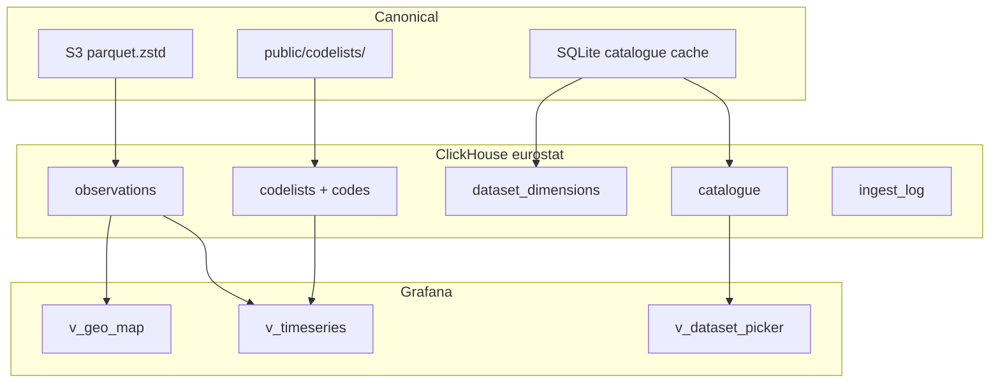

# ClickHouse schema v2 — review spec

Grafana-first unified warehouse for ~7,700 Eurostat datasets.

**Branch:** `feat/clickhouse-ingest`  
**SQL:** [`sql/clickhouse/002_schema.sql`](../sql/clickhouse/002_schema.sql)  
**Prerequisite:** [`001_schema.sql`](../sql/clickhouse/001_schema.sql) (empty tables OK to migrate)

---

## Design decisions (locked in)

| Decision | Choice |
|----------|--------|
| Visualization | **Grafana** — time column, geo, thin SQL views |
| Data model | **Unified** single fact table; diversity via `Map` + metadata |
| Time | **Raw + parsed** — `time_code` preserved, `time_start`/`time_end` for queries |
| Refresh | **Weekly** batch; `ReplacingMergeTree` on re-ingest |

---

## Architecture



---

## Tables

### `catalogue` — dataset directory

Powers Grafana `$dataset` variable and cross-dataset navigation.

| Column | Type | Purpose |
|--------|------|---------|
| `dataset_id` | String | PK, e.g. `nama_10_gdp` |
| `title` | String | Human label for picker |
| `prefix` | String | First path segment (`nama`, `ei`, …) |
| `theme` | String? | Eurostat TOC theme (optional) |
| `dimensions` | Array(String) | All dimension ids for this dataset |
| `primary_geo_dim` | String? | Which col maps to `geo` (usually `geo` or `GEO`) |
| `primary_time_dim` | String? | Which col maps to `time_code` |
| `primary_unit_dim` | String? | Which col maps to `unit` |
| `freq_values` | Array(String) | Supported frequencies: `A`, `Q`, `M`, … |
| `comparable_group` | String? | Soft link for cross-dataset joins (future) |
| `is_featured` | UInt8 | Hero datasets for dashboards |
| `row_count` | UInt64? | From S3 manifest |
| `last_eurostat_update` | DateTime? | From Eurostat TOC |
| `last_ingested_at` | DateTime? | Last ClickHouse load |

**Source:** `eurostat cache refresh` (SQLite) + S3 manifest row counts.

### `dataset_dimensions` — per-dataset schema

| Column | Purpose |
|--------|---------|
| `dataset_id` | FK to catalogue |
| `dimension_id` | e.g. `geo`, `na_item` |
| `position` | Column order in parquet |
| `label` | Display name |
| `codelist_id` | Eurostat codelist for labels |

Enables dynamic Grafana filters and ingest column mapping.

### `codelists` + `codes` — labels

Loaded from [`public/codelists/`](../public/codelists/).

```sql
-- Example
SELECT code, label FROM codes WHERE codelist_id = 'GEO' AND code = 'DE';
-- → Germany
```

Backed by ClickHouse dictionaries `dict_geo_labels`, `dict_unit_labels` for fast `dictGet` in views.

### `observations` — unified facts (core)

| Column | Type | Ingest source |
|--------|------|---------------|
| `dataset_id` | String | S3 key / manifest |
| `prefix` | String | `left(dataset_id, 4)` lowercased |
| `geo` | String? | Promoted from `geo`/`GEO`/`cntry`/… |
| `time_code` | String? | Raw `time`/`TIME_PERIOD` value |
| `time_start` | Date? | **Parsed** — Grafana time axis |
| `time_end` | Date? | Parsed period end |
| `freq` | String? | Promoted from `freq`/`FREQ` or inferred from `time_code` |
| `unit` | String? | Promoted from `unit`/`UNIT` |
| `dimensions` | Map | All non-promoted dimension columns |
| `value` | Float64? | Observation value |
| `status` | String? | Eurostat flags (`b`, `e`, `p`, …) |
| `ingested_at` | DateTime | Load timestamp |
| `revision` | UInt32 | Bump on weekly re-ingest |

**Engine:** `ReplacingMergeTree(ingested_at)`  
**Partition:** `prefix` (~200 partitions, not 7,700)  
**Order:** `(dataset_id, coalesce(geo,''), coalesce(time_start, epoch), hash(dimensions))`

#### What goes in `dimensions` vs promoted columns?

At ingest, for each parquet column:

1. If it matches a **promoted alias** → extract to top-level column
2. Else → `dimensions[col_name] = value`

Promoted aliases (case-insensitive):

| Target | Source column names |
|--------|---------------------|
| `geo` | `geo`, `GEO`, `cntry`, `country`, `partner`, `rep_country` |
| `time_code` | `time`, `TIME_PERIOD`, `TIME`, `period` |
| `freq` | `freq`, `FREQ`, `frequency` |
| `unit` | `unit`, `UNIT` |

If `freq` is empty but `time_code` is set, infer freq from pattern (see below).

---

## Time parsing rules (ingest-time, Rust)

Parse once during `eurostat clickhouse ingest`. ClickHouse stores results; Grafana queries `time_start`.

### Input → output

| `time_code` | Inferred `freq` | `time_start` | `time_end` |
|-------------|-----------------|--------------|------------|
| `2020` | `A` | `2020-01-01` | `2020-12-31` |
| `2020-Q1` | `Q` | `2020-01-01` | `2020-03-31` |
| `2020-Q4` | `Q` | `2020-10-01` | `2020-12-31` |
| `2020-01` | `M` | `2020-01-01` | `2020-01-31` |
| `2020-12` | `M` | `2020-12-01` | `2020-12-31` |
| `2020-W05` | `W` | Monday of ISO week 5 | Sunday of that week |
| `2020-01-15` | `D` | `2020-01-15` | `2020-01-15` |

### Parsing priority

1. Use explicit `freq` column if present
2. Else infer from `time_code` pattern:
   - `^\d{4}$` → annual
   - `^\d{4}-Q[1-4]$` → quarterly
   - `^\d{4}-\d{2}$` → monthly (validate month 01–12)
   - `^\d{4}-W\d{2}$` → weekly (ISO week)
   - `^\d{4}-\d{2}-\d{2}$` → daily
3. If unparseable: `time_start = NULL` (row still stored; excluded from `v_timeseries`)

### Rust pseudocode

```rust
fn parse_time_period(time_code: &str, freq: Option<&str>) -> (Option<String>, Option<NaiveDate>, Option<NaiveDate>) {
    let inferred = freq.map(str::to_string).or_else(|| infer_freq(time_code));
    let (start, end) = match inferred.as_deref() {
        Some("A") => parse_annual(time_code),
        Some("Q") => parse_quarterly(time_code),
        Some("M") => parse_monthly(time_code),
        Some("W") => parse_weekly(time_code),
        Some("D") => parse_daily(time_code),
        _ => (None, None),
    };
    (inferred, start, end)
}
```

---

## Grafana views

### `v_timeseries` — default panel source

```sql
SELECT dataset_id, geo, geo_label, time, time_code, freq, unit, unit_label, value, status
FROM eurostat.v_timeseries
WHERE dataset_id = '$dataset'
  AND geo IN ($geo)
  AND freq = '$freq'
ORDER BY time;
```

- **`time`** = `time_start` — set as Grafana time field
- **`geo_label`** / **`unit_label`** — from dictionaries

### `v_geo_map` — choropleth

Latest value per country for a dataset + freq:

```sql
SELECT geo, geo_label, argMax(value, time) AS value
FROM eurostat.v_geo_map
WHERE dataset_id = '$dataset' AND freq = '$freq'
GROUP BY geo, geo_label;
```

### `v_dataset_picker` — variable source

```sql
SELECT dataset_id, title FROM eurostat.v_dataset_picker;
```

Featured subset: `v_featured_datasets`.

---

## Ingest contract

### Per dataset

1. Read `s3://eurostat/datasets/{prefix}/{id}.parquet.zstd`
2. Infer schema from parquet headers
3. For each row:
   - Promote geo/time/freq/unit
   - Parse `time_start` / `time_end`
   - Pack remaining cols into `dimensions` Map
4. Batch insert (50k rows) into `observations`
5. Upsert `catalogue`, `dataset_dimensions`
6. Append `ingest_log`

### Resume / weekly refresh

Skip when `ingest_log` has `status=ok` AND `s3_row_count` matches manifest.

On change: re-insert with newer `ingested_at`; `ReplacingMergeTree` dedupes on merge.

Optional post-ingest: `OPTIMIZE TABLE observations FINAL` (weekly cron, off-peak).

### Cron (weekly)

```bash
# Sunday 03:00 — adjust as needed
0 3 * * 0  cd /root/projects/eurostat && ./scripts/sync-s3.sh
30 3 * * 0 cd /root/projects/eurostat && ./scripts/clickhouse-ingest.sh
```

---

## Hero datasets (seed `is_featured = 1`)

| Dashboard | `dataset_id` | Typical `freq` |
|-----------|--------------|----------------|
| GDP | `nama_10_gdp` | `A` |
| Inflation | `prc_hicp_manr` | `A` |
| Unemployment | `une_rt_m` | `M` |
| Population | `demo_pjan` | `A` |
| Trade balance | `bop_c6_q` | `Q` |

---

## Migration from v1

`002_schema.sql` drops and recreates `catalogue` and `observations` (safe while empty).

```bash
clickhouse-client --multiquery < sql/clickhouse/002_schema.sql
```

Verify:

```bash
clickhouse-client -d eurostat -q "SHOW TABLES"
clickhouse-client -d eurostat -q "DESCRIBE observations"
clickhouse-client -d eurostat -q "SELECT name FROM system.tables WHERE database='eurostat' AND engine='View'"
```

---

## Open items for review

1. **`comparable_group`** — defer to v3 or seed manually for inflation/GDP clusters?
2. **Dictionary auth** — `dict_*` sources use `localhost` + `default` user; may need password in `SOURCE` on production.
3. **`revision` column** — bump explicitly on re-ingest, or rely on `ingested_at` only?
4. **GEO codelist** — Eurostat uses `GEO` codelist; confirm code format (ISO 2/3) matches map panel expectations.
5. **Full vs incremental first load** — pilot 5 hero datasets before full 7.7k ingest?

---

## File index

| File | Purpose |
|------|---------|
| `sql/clickhouse/001_schema.sql` | v1 bootstrap (superseded by 002 for core tables) |
| `sql/clickhouse/002_schema.sql` | **v2 schema + views + dictionaries** |
| `docs/CLICKHOUSE_SCHEMA.md` | This review spec |
| `docs/CLICKHOUSE.md` | Ingestion rollout plan |
