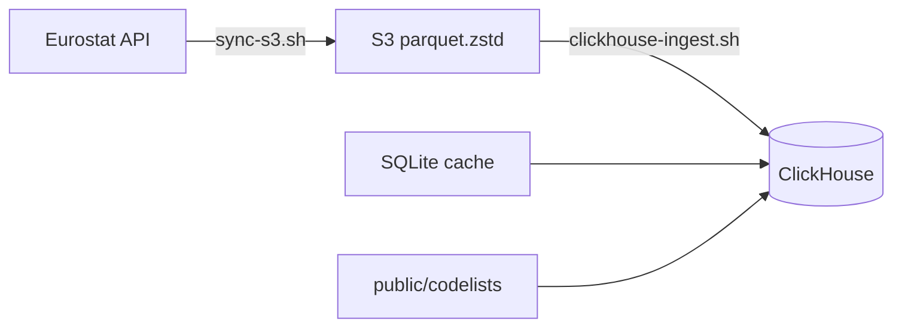

# Deployment & operations

Operate the full Eurostat pipeline on a Linux server:

**Eurostat API → S3 (parquet.zstd) → ClickHouse → dashboards**

| Doc | Purpose |
|-----|---------|
| [CONFIGURATION.md](CONFIGURATION.md) | **Env vars**, S3, ClickHouse, TLS |
| [SERVER.md](SERVER.md) | Fresh install and first S3 sync |
| [CLICKHOUSE.md](CLICKHOUSE.md) | Schema design, CLI reference, architecture |
| [CLICKHOUSE_SCHEMA.md](CLICKHOUSE_SCHEMA.md) | v2 table/column spec |

Below, `$REPO` is your clone path (for example `~/eurostat`).

---

## Pipeline overview



1. **S3 mirror** — canonical store; safe to stop/resume.
2. **ClickHouse ingest** — reads S3 manifest (`status=ok` only); resume skips unchanged `row_count`.
3. **Codelists** — one-time (or after Eurostat releases) for GEO/UNIT labels in views.

---

## Prerequisites

- Rust 1.85+ and built CLI (`./scripts/install.sh` or `cargo install --path crates/eurostat-cli`)
- ClickHouse server (local or remote)
- `~/.env` with S3 + ClickHouse variables — see [CONFIGURATION.md](CONFIGURATION.md)
- Schema applied: `sql/clickhouse/002_schema.sql`

---

## Environment variables

Add S3 + ClickHouse values to `~/.env` using `.env.example` as a reference (append or edit in place — never replace `~/.env`).

**Local ClickHouse** (default):

```bash
CLICKHOUSE_HOST=127.0.0.1
CLICKHOUSE_PORT=9000
CLICKHOUSE_HTTP_PORT=8123
CLICKHOUSE_USER=default
CLICKHOUSE_PASSWORD=...
CLICKHOUSE_DATABASE=eurostat
CLICKHOUSE_TLS=0
CLICKHOUSE_INGEST_PARALLEL=4
```

**Remote ClickHouse** — enable TLS so credentials are not sent in cleartext:

```bash
CLICKHOUSE_HOST=clickhouse.example.com
CLICKHOUSE_PORT=9440
CLICKHOUSE_HTTP_PORT=8443
CLICKHOUSE_TLS=1
```

Full tables and security notes: **[CONFIGURATION.md](CONFIGURATION.md)**.

---

## One-time setup

### 1. Apply ClickHouse schema

```bash
cd "$REPO"
clickhouse-client --multiquery < sql/clickhouse/002_schema.sql
clickhouse-client -d eurostat -q "SHOW TABLES"
```

Apply order: `001_schema.sql` → `002_schema.sql` (see [sql/clickhouse/README.md](../sql/clickhouse/README.md)).

### 2. Build CLI (if not installed globally)

```bash
cd "$REPO"
cargo build --release -p eurostat-cli
export EUROSTAT_BIN="$REPO/target/release/eurostat"
```

### 3. Refresh catalogue cache (for dataset titles/metadata)

```bash
eurostat cache refresh
```

### 4. Load codelists (GEO + UNIT labels)

```bash
eurostat clickhouse load-codelists
# Optional full load (~650 codelists, slow):
# eurostat clickhouse load-codelists --all
```

---

## S3 mirror (initial + ongoing)

```bash
cd "$REPO"
chmod +x scripts/sync-s3.sh
./scripts/sync-s3.sh
```

**Background** (first full corpus — days depending on bandwidth):

```bash
LOG_DIR="${EUROSTAT_LOG_DIR:-/var/log/eurostat}"
sudo mkdir -p "$LOG_DIR" && sudo chown "$(id -u):$(id -g)" "$LOG_DIR"
cd "$REPO"
nohup ./scripts/sync-s3.sh >> "$LOG_DIR/sync-s3.log" 2>&1 &
```

Monitor:

```bash
tail -f "${EUROSTAT_LOG_DIR:-/var/log/eurostat}/sync-s3.log"
pgrep -af "eurostat mirror s3"
cd "$REPO" && eurostat mirror status --s3
```

Re-run anytime; `--resume` skips objects already in the bucket.

---

## ClickHouse ingest (full corpus)

Wait until S3 has sufficient coverage (ingest only processes manifest entries with `status=ok`). Pilot/smoke test first:

```bash
cd "$REPO"
eurostat clickhouse ingest --featured --resume --limit 5
eurostat clickhouse status
```

### Full corpus (background)

```bash
LOG_DIR="${EUROSTAT_LOG_DIR:-/var/log/eurostat}"
cd "$REPO"
nohup ./scripts/clickhouse-ingest.sh >> "$LOG_DIR/clickhouse-ingest.log" 2>&1 &
```

The script checks ClickHouse connectivity, verifies `observations` exists, then runs:

```bash
eurostat clickhouse ingest --resume --parallel "${CLICKHOUSE_INGEST_PARALLEL:-4}"
```

Monitor:

```bash
tail -f "${EUROSTAT_LOG_DIR:-/var/log/eurostat}/clickhouse-ingest.log"
pgrep -af "clickhouse ingest"
eurostat clickhouse status
```

### Manual / targeted ingest

```bash
# All manifest ok datasets, resume unchanged
eurostat clickhouse ingest --resume --parallel 4

# Hero datasets only
eurostat clickhouse ingest --featured --resume

# Explicit list
eurostat clickhouse ingest --datasets nama_10_gdp,une_rt_m --resume
```

---

## Validation

```bash
# Ingest ledger
clickhouse-client -d eurostat -q "
  SELECT status, count() FROM ingest_log GROUP BY status
"

# Datasets loaded
clickhouse-client -d eurostat -q "
  SELECT count(DISTINCT dataset_id) FROM observations
"

# Sample timeseries (requires codelists + working dictionaries)
clickhouse-client -d eurostat -q "
  SELECT * FROM v_timeseries WHERE dataset_id = 'nama_10_gdp' LIMIT 5
"

# Catalogue
clickhouse-client -d eurostat -q "
  SELECT dataset_id, title, dimensions FROM catalogue LIMIT 10
"
```

After a large re-ingest (off-peak):

```bash
clickhouse-client -d eurostat -q "OPTIMIZE TABLE observations FINAL"
```

---

## Weekly cron (recommended)

Sunday batch: refresh S3, then ingest new/changed datasets into ClickHouse.

```cron
# Eurostat → S3 (Sunday 03:00 UTC)
0 3 * * 0  cd /path/to/eurostat && ./scripts/sync-s3.sh >> /var/log/eurostat/sync-s3.log 2>&1

# S3 → ClickHouse (Sunday 03:30 UTC; resume skips unchanged)
30 3 * * 0 cd /path/to/eurostat && ./scripts/clickhouse-ingest.sh >> /var/log/eurostat/clickhouse-ingest.log 2>&1
```

Install (as the user that owns `~/.env`):

```bash
./scripts/install-cron.sh              # creates /var/log/eurostat if needed
./scripts/install-cron.sh --dir /opt/eurostat
./scripts/install-cron.sh --uninstall  # remove Eurostat cron block only
```

Re-run `install-cron.sh` after upgrading from older installs that logged into the repo directory — it rewrites the managed cron block to use `/var/log/eurostat`.

Or manually with `crontab -e` — paste lines above with your REPO path.

Optional quarterly codelist refresh (Eurostat releases):

```cron
0 4 1 */3 * cd /path/to/eurostat && eurostat clickhouse load-codelists >> /var/log/eurostat/codelists.log 2>&1
```

---

## Troubleshooting

| Problem | Fix |
|---------|-----|
| `schema not applied` | `clickhouse-client --multiquery < sql/clickhouse/002_schema.sql` |
| `S3_URL` / `S3_ACCESS_KEY` is not set | Run via `./scripts/*.sh` or `source ~/.env` |
| Ingest skips everything | Expected with `--resume` if `ingest_log` row_count matches manifest; drop log rows or wait for S3 updates |
| `v_timeseries` / `dictGet` errors | Dictionaries in `002_schema.sql` may need password in `SOURCE`; reload after fixing auth |
| Slow ingest | Raise `CLICKHOUSE_INGEST_PARALLEL`; ensure HTTP(S) port reachable (`8123` or `8443` with TLS) |
| Duplicate observation rows | Re-ingest before JSONEachRow fix; run `OPTIMIZE TABLE observations FINAL` |
| S3 still syncing | Ingest proceeds on `status=ok` datasets only; re-run ingest after sync completes |

---

## Scripts reference

| Script | Command |
|--------|---------|
| `scripts/sync-s3.sh` | `eurostat mirror s3 --source dissemination --resume` |
| `scripts/clickhouse-ingest.sh` | `eurostat clickhouse ingest --resume --parallel N` |
| `scripts/install-cron.sh` | Weekly cron for sync + ingest (`--uninstall` to remove) |

---

## Related CLI

```bash
eurostat mirror status --s3
eurostat clickhouse status
eurostat clickhouse load-codelists [--all]
eurostat cache refresh
```
